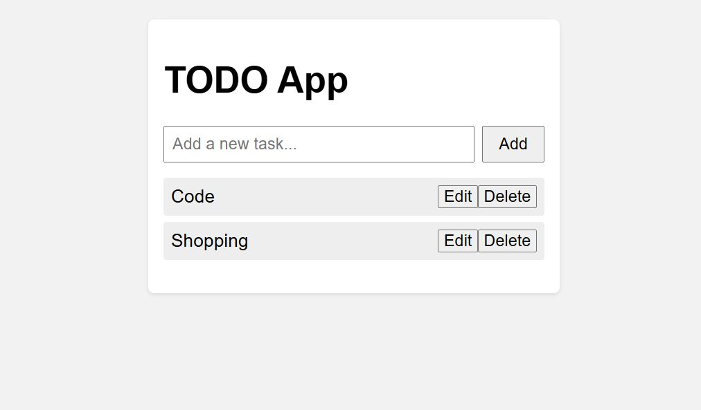

# 📝 TODO App

A simple and interactive TODO App built with **HTML**, **CSS**, and **Vanilla JavaScript**. This app allows users to add, edit, delete, and manage their tasks efficiently — complete with a modal-based task editor and validation.

---
**🔗 GitHub Repository Link:**
(https://github.com/rashid-subhani/todo-list-app)

🌐 Live Demo: https://rashid-subhani.github.io/todo-list-app/

## 📌 Features

- ➕ Add new tasks
- 📝 Edit existing tasks via modal popup
- ❌ Delete tasks
- 🧠 Prevents duplicate and empty tasks
- 🪟 Close modal with `X` button or by clicking outside
- 💾 Live updates without page reload

---

## 🚀 Getting Started

### 📁 Folder Structure

```

todo-app/
├── index.html
├── css/
│   └── style.css
├── js/
│   └── script.js
└── README.md

````

---

### 🧰 Prerequisites

Just a modern browser! No frameworks or build tools required.

---

### 🔧 How to Use

1. **Clone the Repository**
   ```bash
   git clone https://github.com/rashid-subhani/todo-list-app
   cd todo-list-app
````

2. **Open in Browser**

   * Open `index.html` directly in your web browser
   * Or use Live Server in VS Code for real-time updates

---

## ✨ Screenshots

> Screenshots here :
* **Main App View **: 


* **Edit Task Modal** 

---

## 📂 Future Improvements

* ✅ Add task completion checkbox
* 📅 Add due dates and reminders
* 🌙 Dark mode


---

## 📄 License

This project is open source and available under the [MIT License](LICENSE).

---

## 🙌 Author

Made with 💻 by Rashid Subhani
Feel free to connect: [LinkedIn](https://www.linkedin.com/in/rashid-subhani/) | [GitHub](https://github.com/rashid-subhani)

```

